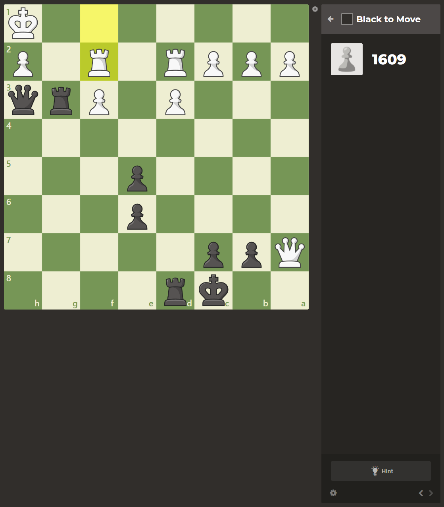
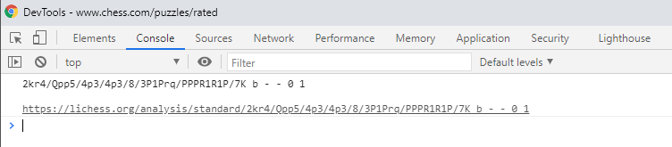
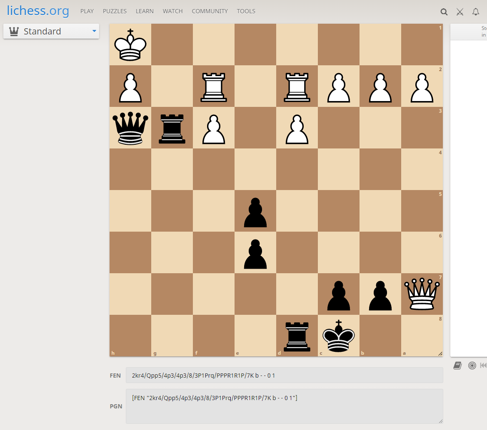

# What Does this Code Do?

I wrote some JS code that reads the state of a chess com board by parsing the HTML, outputs the FEN of the puzzle, and converts the FEN into a link that will open an analysis board on Lichess with the obtained board state.   

# How to Use This Code

1. Open <a href="https://strawstack.github.io/ChessComPuzzleToLichess/" target="_blank">this site</a>.

2. Drag the link into your bookmarks bar.

3. When viewing a chess com puzzle, click the bookmarklet.

4. Obtain the Lichess FEN link by opening the browser's console.

# More Info about Bookmarklets

https://caiorss.github.io/bookmarklet-maker/

# View the Source Code

The JS source code for this tool is available in `source.js`

# Screenshots

### A Chess com puzzle.

### The output link from this code. 

### The result of navigating to the link

